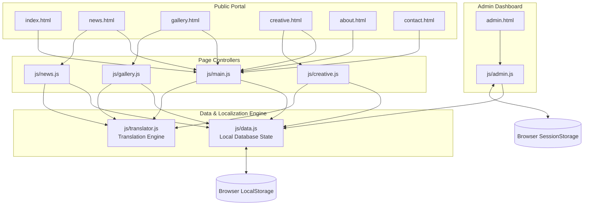

# Project Blueprint: "परिवर्तनका लागि आवाज" (Voice for Change)

This blueprint provides a comprehensive review of the project's technical architecture, a walkthrough of implemented features, and a structured implementation roadmap for future expansion.

---

## 1. System Architecture

The project is structured as a premium, highly responsive static web application with a client-side database layer. Both the public portal and the admin dashboard interact with a unified state manager, synchronizing data across the entire site instantly using browser storage.

### File Interactions
- **Database & State (`js/data.js`)**: Exposes the global `APP_DATA` database state, falls back to `DEFAULT_APP_DATA` on first load, and provides utility functions like `saveAppData()` and `getFormattedDate()`.
- **Localization Engine (`js/translator.js`)**: Dynamically reads elements with `data-i18n` attributes and injects translated strings. It also translates dynamically-rendered databases on the fly without mutating the database structure.
- **Main Controller (`js/main.js`)**: Configures dark/light theme, scrolls behavior, search indexing, mobile sidebar menus, and manages the floating submission form.
- **Page Controllers (`js/news.js`, `js/gallery.js`, `js/creative.js`)**: Render cards, filter lists, construct lightbox views, and handle user interactions (likes/comments).
- **Admin Controller (`js/admin.js`)**: Controls dashboard analytics, manages CRUD operations, handles Base64 image encoding, moderates comments, and controls the submissions approval pipeline.

---

## 2. Feature Walkthrough (What Has Been Built)

### A. The Public Portal
- **Landing Page (`index.html`)**: Features a premium breaking news hero block, a latest news section, photo gallery preview grid, featured creative writing widgets, and a newsletter subscription form.
- **News Room (`news.html` / `js/news.js`)**: Lists all news stories with full category filtering, live searching, and dynamic single-article detail rendering (updating the page without a full reload).
- **Photo Gallery (`gallery.html` / `js/gallery.js`)**: Interactive masonry image grid with category filter tabs and a fullscreen overlay lightbox that showcases captions and categories.
- **Creative Corner (`creative.html` / `js/creative.js`)**: Features creative writing grouped by category (Stories, Poems, Novels). Readers can customize text styles (Serif/Sans, font sizes). Novels include a chapter selector and page-by-page reader. Users can like and submit comments.
- **Feedback & Information (`about.html`, `contact.html`)**: Interactive forms, maps, team information, and office contacts.

### B. Localization Engine (Nepali <-> English)
- **Zero-Reload Switching**: Clicking the language toggle (labeled `EN` / `ने` depending on active language) dynamically swaps static labels (anchored by `data-i18n` attributes) and database content (titles, excerpts, categories).
- **Dynamic Content Mapping**: To prevent backend/admin data corruption, the translation engine maps default mock database strings in a comprehensive lookup dictionary (`js/translator.js`), maintaining compatibility with content-editing forms.
- **Numeric & Date Conversions**: The engine converts numbers and dates dynamically (e.g., standard Arabic digits `0-9` translate to Nepali numerals `०-९`, and English month names translate to Nepali equivalents).
- **Preference Storage**: Active language settings are saved to `localStorage`, remaining persistent across tab refreshes.

### C. Admin Control Panel
- **Security Checkpoint**: Protected by a login card requiring passcode **`admin123`**, with sessions saved securely in `sessionStorage` (automatic logout when closing tabs).
- **Analytics Overview**: Stat cards indicating total news posts, gallery uploads, creative writing pieces, and comment counts.
- **Content Management (CRUD)**:
  - **News**: Search and category filtering. Create/edit/delete records. Modals support file uploads (automatically encoded as Base64) or direct URLs.
  - **Gallery**: Captions and image source selectors.
  - **Creative Writing**: Special form inputs for Stories/Poems vs. Novels. Novel creations include an embedded **Chapter Builder** to add, order, and edit multiple chapter titles and text bodies.
- **Comments Moderation**: Aggregates all comments in a list with search filters, enabling admins to prune and delete inappropriate comments.
- **Submissions Queue**: Real-time review of user-submitted articles, poems, or photos. Selecting **Approve** copies the submission data directly into the appropriate content form for finishing and publishing, removing it from the pending submissions list.

---

## 3. Data Persistence Details

The application operates entirely on **client-side memory persistence**:
1. On page load, `js/data.js` runs first to check if the browser contains an existing database record under the key `APP_DATA` in `localStorage`.
2. If found, it parses it into the global variable `window.APP_DATA`. If absent, it populates it with `DEFAULT_APP_DATA` (the pre-defined list of articles/photos) and writes it to `localStorage`.
3. When user events occur (e.g., submitting a comment, liking a story, sending a submission form, or editing articles in the admin dashboard), the respective script updates `window.APP_DATA` directly and invokes `window.saveAppData()`.
4. Visual components listen to changes or check state before rendering to guarantee the interface remains synchronized.

> [!WARNING]
> Because data is stored locally in the browser, clearing the browser's cookies/storage will reset the database to default values. Additionally, changes made in one browser/computer will not be visible to users on another machine.

---

## 4. Further Development Roadmap (What You Can Do Next)

Here are the concrete recommendations for the next phases of development, arranged by technical complexity and project impact.

### Phase 1: Database & Backend Migration (Highly Recommended)
To make the site a true multi-user platform, we need a centralized backend rather than local storage.

| Step | Goal | Details | Files to Modify/Create |
|---|---|---|---|
| **1.1** | **Setup Backend Server** | Create a simple Express.js server (Node.js) or configure a backend-as-a-service like **Supabase** or **Firebase**. | Create `server.js`, `package.json` |
| **1.2** | **Define DB Schema** | Create a database schema (MongoDB/Mongoose or PostgreSQL) replicating the `APP_DATA` structure. | Create DB models for News, Gallery, Creative, Comments, and Submissions |
| **1.3** | **API Route Integration** | Replace `saveAppData()` and local reads with standard `fetch` API requests to endpoints (e.g., `GET /api/news`, `POST /api/submissions`). | [data.js](file:///d:/project/Antigravity_project_trial/js/data.js), [admin.js](file:///d:/project/Antigravity_project_trial/js/admin.js) |

### Phase 2: Rich Media & Advanced Editing
Enhance the layout control and avoid running into LocalStorage size limits (usually capped around 5MB, which gets exhausted quickly by Base64 image uploads).

*   **Integrated Rich Text Editors**: Embed a lightweight editor like **Quill.js** or **Trumbull** into the Admin dashboard. This allows administrators to format text, add bold styling, headers, blockquotes, or links visually instead of writing manual HTML strings in textareas.
*   **Media Hosting API**: Instead of saving images as Base64 strings in the database, configure the admin file upload to send images directly to **Cloudinary** or **AWS S3**, saving only the resulting image URL inside the database record.

### Phase 3: Secure Authentication
Replace the client-side authentication wall with industry-standard security.

*   **Secure Admin Sign In**: Implement JWT (JSON Web Tokens) or session cookies.
*   **Encrypted Passwords**: Hash passwords using `bcrypt` on the server.
*   **Multi-role Access**: Create separate user levels (e.g., "Editor" can draft news but not delete, "Administrator" has full delete privileges).

### Phase 4: User Accounts & Interactivity
Increase user engagement on the public site.

*   **User Profiles**: Let visitors register, log in, view their submission histories, and save bookmarked articles to read later.
*   **Notification Engine**: Set up notifications (e.g., "A comment was approved on your poem" or "Your article has been published").
*   **Advanced Search**: Replace the simple text matching filter with a client-side fuzzy search engine (like **Fuse.js**) to search efficiently across titles, categories, and translation keys simultaneously.
